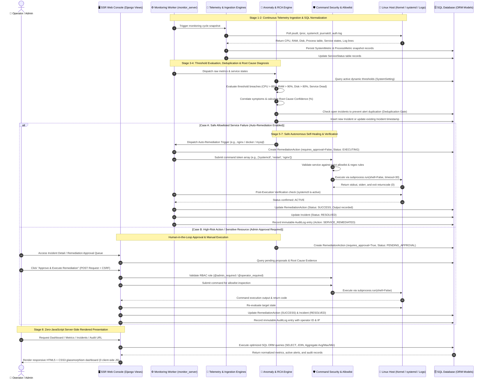
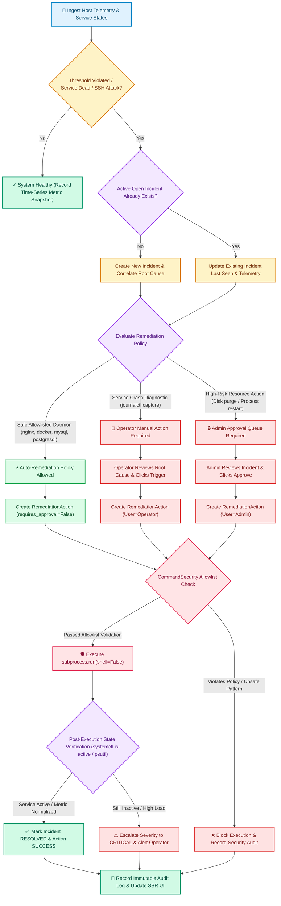

# LinuxGuard – Intelligent Linux Server Monitoring & Auto-Remediation Platform

[](https://www.python.org/)
[](https://www.djangoproject.com/)
[](https://ubuntu.com/)
[](LICENSE)
[](tests/)
[-success.svg)](templates/)

---

## 🏗️ 3D System Architecture Visualization


*Figure 1: 3D Isometric System Architecture of the LinuxGuard Platform (Target Server Hardware → Python Telemetry Engines → Relational SQL Persistence & Django Core → Zero-JS Glassmorphism Web Interface).*

---

## 🏛️ Comprehensive System Architecture Diagram

```mermaid
graph TD
    %% Styling Definitions
    classDef serverBox fill:#dcfce7,stroke:#15803d,stroke-width:2px,color:#14532d;
    classDef monitorBox fill:#fef3c7,stroke:#d97706,stroke-width:2px,color:#78350f;
    classDef engineBox fill:#e0f2fe,stroke:#0284c7,stroke-width:2px,color:#0c4a6e;
    classDef dbBox fill:#fee2e2,stroke:#dc2626,stroke-width:2px,color:#7f1d1d;
    classDef djangoBox fill:#f3e8ff,stroke:#9333ea,stroke-width:2px,color:#581c87;
    classDef uiBox fill:#dcfce7,stroke:#16a34a,stroke-width:2px,color:#14532d;
    classDef scriptBox fill:#e0e7ff,stroke:#4f46e5,stroke-width:2px,color:#312e81;
    classDef securityBox fill:#ffe4e6,stroke:#e11d48,stroke-width:2px,color:#881337;
    classDef userBox fill:#f1f5f9,stroke:#475569,stroke-width:2px,color:#0f172a;

    %% 1. Target Linux Server
    subgraph TargetSystem ["🐧 Linux Server (Target System - Ubuntu / Linux)"]
        SR["System Resources (CPU, RAM, Disk, Load)"]
        RP["Running Processes (Top CPU/Memory)"]
        SVC["Services (systemctl)"]
        NET["Network (Interfaces, Connections)"]
        LOGS["System Logs (journalctl, /var/log)"]
        SEC["Security Events (SSH Failed Logins)"]
    end
    class TargetSystem,SR,RP,SVC,NET,LOGS,SEC serverBox;

    %% 2. Python Monitoring Services
    subgraph MonitoringServices ["🐍 Python Monitoring Services"]
        SM["system_monitor.py (psutil)"]
        PM["process_monitor.py"]
        SVM["service_monitor.py"]
        DM["disk_monitor.py"]
        NM["network_monitor.py"]
        LA["log_analyzer.py"]
        SSHM["ssh_monitor.py"]
    end
    class MonitoringServices,SM,PM,SVM,DM,NM,LA,SSHM monitorBox;

    %% 3. Analysis & Detection Engine
    subgraph EngineLayer ["🧠 Analysis & Detection Engine"]
        AD["anomaly_detector.py (Check Thresholds)"]
        SE["severity_engine.py (Determine Severity)"]
        RCE["root_cause_engine.py (Find Probable Cause)"]
        RE["remediation_engine.py (Suggest/Execute Fix)"]
        CS["command_security.py (Validate Safe Commands)"]
    end
    class EngineLayer,AD,SE,RCE,RE,CS engineBox;

    %% 4. Database Layer
    subgraph DBLayer ["🗄️ Database (SQL - SQLite / MySQL)"]
        T_USER["User (RBAC)"]
        T_SRV["Server"]
        T_SM["SystemMetric"]
        T_PM["ProcessMetric"]
        T_SS["ServiceStatus"]
        T_INC["Incident"]
        T_RA["RemediationAction"]
        T_SE["SecurityEvent"]
        T_AL["AuditLog"]
    end
    class DBLayer,T_USER,T_SRV,T_SM,T_PM,T_SS,T_INC,T_RA,T_SE,T_AL dbBox;

    %% 5. Django Core Application
    subgraph DjangoApp ["🌐 Django Web Application"]
        D_VIEWS["Views (views.py)"]
        D_URLS["URLs (urls.py)"]
        D_MODELS["Models (models.py)"]
        D_FORMS["Forms (forms.py)"]
        D_RBAC["Authentication (RBAC)"]
        D_TPL["Templates (HTML5)"]
        D_CSS["Static Files (CSS3)"]
    end
    class DjangoApp,D_VIEWS,D_URLS,D_MODELS,D_FORMS,D_RBAC,D_TPL,D_CSS djangoBox;

    %% 6. Management Worker
    MGMT["⚙️ Django Management Command<br/><b>python manage.py monitor_server</b><br/>1. Collect Metrics | 2. Store Metrics | 3. Detect Incidents<br/>4. Analyze Root Cause | 5. Generate Recommendations<br/>6. Execute Safe Remediation | 7. Record Audit Logs"]
    class MGMT engineBox;

    %% 7. Safe Command Execution
    SAFE_EXEC["🛡️ Safe Command Execution (Allowlist Only)<br/>✓ systemctl status/restart &lt;service&gt;<br/>✓ df, du, free, top, ps, uptime<br/>✓ journalctl (read-only)<br/>✓ ip, ss, ping | ✓ Collect logs<br/>❌ No dangerous commands (rm, reboot, kill -9)"]
    class SAFE_EXEC securityBox;

    %% 8. Bash Automation Scripts
    subgraph BashScripts ["📜 Bash Scripts (Linux Automation)"]
        B_SETUP["scripts/setup_ubuntu.sh"]
        B_HEALTH["scripts/health_check.sh"]
        B_DISK["scripts/disk_report.sh"]
        B_LOGS["scripts/collect_logs.sh"]
    end
    class BashScripts,B_SETUP,B_HEALTH,B_DISK,B_LOGS scriptBox;

    %% 9. Web Dashboard & Users
    DASHBOARD["🖥️ Web Dashboard (HTML + CSS)<br/>• Server Overview • System Metrics • Process Table<br/>• Service Health • Incidents • Remediation Actions<br/>• Security Events • Audit Logs • Settings"]
    class DASHBOARD uiBox;

    USERS["👥 Users (Web Browser)<br/>• Admin (Full Access)<br/>• Operator (Monitoring & Safe Remediation)<br/>• Viewer (Read-Only)"]
    class USERS userBox;

    %% Connections
    TargetSystem -->|Collect Real-time Data| MonitoringServices
    MonitoringServices -->|Raw Metrics & Events| EngineLayer
    EngineLayer -->|Store Data & Incidents| DBLayer
    DBLayer <-->|Read / Write Data (ORM)| DjangoApp
    MGMT -->|Scheduled Monitoring| TargetSystem
    MGMT -->|Send Processed Data| EngineLayer
    MGMT -->|Update Database| DBLayer
    EngineLayer -->|Execute Remediation (If Approved)| SAFE_EXEC
    BashScripts -->|Run Safe Predefined Commands| SAFE_EXEC
    SAFE_EXEC -->|Execute Linux Commands| TargetSystem
    DjangoApp -->|Render Pages (HTML + CSS)| DASHBOARD
    DASHBOARD <-->|View Data & Take Actions (Form Submission)| USERS
```

---

## 🔄 Architecture Pipeline & End-to-End Workflow

LinuxGuard implements a closed-loop, deterministic pipeline that spans from low-level Linux kernel telemetry collection to rule-based root cause analysis, safe auto-remediation, post-execution verification, SQL persistence, and zero-JavaScript Server-Side Rendered (SSR) dashboard presentation.

```
+-----------------------------------------------------------------------------------------------------------------------------------------------------------------------+
|                                                          LINUXGUARD SYSTEM LIFECYCLE & DATAFLOW                                                                       |
+-----------------------------------------------------------------------------------------------------------------------------------------------------------------------+
|                                                                                                                                                                       |
|   [1. User (Browser)]                                                                                                                                                 |
|           │ (1. Open Web Application)                                                                                                                                 |
|           ▼                                                                                                                                                           |
|   [2. Web Interface (HTML + CSS)] ──── (2. Submit Credentials via POST) ────► [3. Django Application] ──── (4. Save/Read Data via ORM) ────► [4. SQL Database]        |
|           ▲                                                                             │                                                              ▲              |
|           │                                                                             │                                                              │              |
|           │ (3. Return SSR Dashboard)                                                   │                                                              │              |
|           │                                                                             ▼                                                              │ (6. Store)   |
|   [12. Update Dashboard] ◄───────────────────────────────────────────── [5. Python Monitoring Services] ◄──────────────────────────────+           │              |
|           ▲                                                                             │ (7. Collect Real-time Data via psutil/commands)       │           │              |
|           │                                                                             ▼                                                      │           │              |
|           │                                                                    [6. Linux / Ubuntu Server]                                      │           │              |
|           │                                                                             │                                                      │           │              |
|           │                                                                             ▼ (8. Send Metrics & Telemetry)                        │           │              |
|           │                                                                 [8. Analysis & Decision Engine] ───────────────────────────────────+           │              |
|           │                                                                             │                                                                          │              |
|           │                                                                             ▼ (9. Safe Remediation Trigger)                                            │              |
|           │                                                                 [9. Safe Command Execution] ───────────────────────────────────────────────────────────+              |
|           │                                                                             │                                                                          │              |
|           │                                                                             ▼ (10. Record Action)                                                      │              |
|           │                                                                 [11. Audit Log (SQL)] ─────────────────────────────────────────────────────────────────+              |
|           │                                                                             │                                                                                         |
|           +─────────────────────────────────────────────────────────────────────────────+                                                                                         |
|                                                                                                                                                                       |
+-----------------------------------------------------------------------------------------------------------------------------------------------------------------------+
|  COMPLETE WORKFLOW PIPELINE:                                                                                                                                          |
|  [1] User Login ──► [2] Access Dashboard ──► [3] View Server Health ──► [4] Continuous Monitoring ──► [5] Detect Threshold Anomaly ──► [6] Correlate Root Cause      |
|  ──► [7] Suggest / Execute Safe Fix ──► [8] Verify Service State ──► [9] Persist in SQL ──► [10] Refresh Dashboard ──► [11] Immutable Audit Log                     |
+-----------------------------------------------------------------------------------------------------------------------------------------------------------------------+
```

---

### 1. Sequence Pipeline Flowchart (Data Movement Across Subsystems)

The following sequence diagram details the exact chronological execution path from background telemetry harvesting to automated remediation, post-fix state validation, and UI presentation:



---

### 2. Auto-Remediation Triage & Decision Policy Gate

LinuxGuard enforces a strict triage decision tree to classify detected system anomalies into autonomous self-healing, manual operator triggers, or admin-approved actions:



---

### 3. End-to-End 8-Stage Architecture Pipeline Deep Dive

#### Stage 1: Real-Time Host Telemetry Harvesting & Probing
- **Telemetry Engines**: `SystemMonitor`, `ProcessMonitor`, `ServiceMonitor`, `SSHMonitor`, and `LogAnalyzer`.
- **Operating System Interface**: Directly interrogates Linux kernel counters (`/proc/stat`, `/proc/meminfo`, `/proc/diskstats`), systemd daemon control planes (`systemctl is-active`, `systemctl list-unit-files`), Linux error journals (`journalctl -p err..alert -n 50`), and authentication logs (`/var/log/auth.log`).
- **Non-Blocking Execution**: Enforces sub-second timeouts to guarantee that slow OS probes never block core event dispatching.

#### Stage 2: Metric Normalization, Sanitization & SQL Relational Persistence
- **Data Normalization**: Raw CPU percentages (user, system, idle), memory breakdowns (used, available, swap), filesystem mounts, and network I/O deltas are validated and cast into strongly typed Python primitives.
- **Relational Storage**: Inserts records into `monitoring_systemmetric` (time-series hardware snapshot) and `monitoring_processmetric` (top consuming processes), while performing `update_or_create` on `monitoring_servicestatus`.

#### Stage 3: Threshold Anomaly Detection & Incident Deduplication
- **Dynamic Rule Evaluation**: Evaluates active metrics against threshold rules stored in `monitoring_systemsetting` (defaulting to CPU > 85%, RAM > 90%, Disk > 80%, SSH Auth Failures >= 5, and any critical daemon in `INACTIVE` or `FAILED` state).
- **Incident Deduplication**: Checks for existing open/investigating incidents for the same server and component. If an active incident exists, it updates telemetry metrics and timestamps without triggering alert storms or duplicate notification spam.

#### Stage 4: Rule-Based Root Cause Diagnosis & Evidence Synthesis
- **Multivariate Correlation**: `RootCauseEngine` correlates metric anomalies with process and service states:
  - **High CPU**: Correlates overall CPU spike with top process PIDs to distinguish runaway worker loops from distributed load contention.
  - **High RAM**: Pinpoints individual process memory allocations and correlates them with system swap saturation.
  - **Disk Saturation**: Correlates partition capacity with `/var/log` consumption and growth patterns.
  - **Daemon Failure**: Correlates service dead states with systemd exit codes and recent `journalctl` error logs.
- **Diagnostic Output**: Generates a **Probable Cause**, a mathematical **Confidence Score (70% - 95%)**, a human-readable **Evidence Summary**, and a step-by-step **Remediation Recommendation**.

#### Stage 5: Remediation Decision Engine & Governance Gating
- **Remediation Policy Evaluation**: `RemediationEngine` determines the remediation pathway:
  - **Autonomous Self-Healing**: Safe, predefined daemons (`nginx`, `docker`, `mysql`, `postgresql`) are flagged with `requires_approval=False` for immediate automated recovery.
  - **Human-in-the-Loop Operator Actions**: Diagnostic captures and service checks require manual trigger by authenticated operators.
  - **Admin Approval Queue**: Potentially disruptive actions (process termination, partition cleanup, configuration updates) require explicit authorization from an `ADMIN` user.

#### Stage 6: Security Sandbox & Command Allowlist Enforcement
- **Allowlist Filtering**: Every command is validated by `CommandSecurity` before reaching the execution layer:
  - Validates that command tokens match strict allowlist patterns (e.g., `systemctl restart <service>`, `df -h`, `uptime`, `free -m`).
  - Validates service parameters against a strict set of alphanumeric identifiers.
  - Blocks dangerous shell characters (`|`, `&`, `;`, `$()`, `` ` ``, `>`, `<`) and forbidden destructive commands (`rm`, `rm -rf`, `shutdown`, `reboot`, `kill -9`, `mkfs`, `dd`).
- **Safe Subprocess Execution**: Commands are strictly invoked with `subprocess.run(command_list, shell=False, timeout=30)`.

#### Stage 7: Closed-Loop Post-Execution Verification
- **State Validation**: Rather than assuming execution success, the platform immediately verifies system state after command completion:
  - For service restarts: Queries `systemctl is-active <service>` to confirm the daemon transitioned to active running state.
  - For system metrics: Re-evaluates CPU and memory levels to ensure recovery.
- **Incident Resolution**: If verified active, the incident is automatically transitioned to `RESOLVED` and the remediation action marked `SUCCESS`. If still failing, the incident is escalated to `CRITICAL` with state `INVESTIGATING`.

#### Stage 8: Immutable Audit Logging & Zero-JS SSR Presentation
- **Forensic Audit Logging**: Records every login, metric cycle, incident update, settings change, and remediation execution in `monitoring_auditlog` with actor identity, timestamp, resource ID, IP address, and execution result.
- **Server-Side Rendered (SSR) Presentation**: Views query the SQL database using Django ORM (`select_related`, `prefetch_related`, `aggregate`) and render responsive HTML5/CSS3 templates. Zero client-side JavaScript ensures maximum speed, minimal attack surface, and seamless browser compatibility.

---

### 4. Pipeline Data Flow & State Lifecycle Matrix

| Pipeline Stage | Ingested Data / Input Artifacts | Processing Engine / Component | Output Artifact / DB Record | Security & Verification Controls |
| :--- | :--- | :--- | :--- | :--- |
| **1. Ingestion** | Linux `/proc`, `psutil`, `systemctl`, logs | `SystemMonitor`, `ServiceMonitor`, `SSHMonitor` | In-memory raw telemetry dictionaries | Non-blocking execution, timeout bounded (10s) |
| **2. Storage** | Telemetry dictionaries | Django ORM / SQLite / MySQL | `SystemMetric`, `ProcessMetric`, `ServiceStatus` | SQL parameterized queries, data sanitization |
| **3. Detection** | Ingested metrics, dynamic settings | `AnomalyDetector`, `SeverityEngine` | Evaluated anomaly list, severity flags | Deduplication window check, threshold validation |
| **4. Root Cause** | Metric breaches + Top 10 process table | `RootCauseEngine` | `Incident` record with RCA & confidence % | Rule-based reasoning, confidence scoring |
| **5. Decision Gate** | Unresolved incidents & service types | `RemediationEngine` | `RemediationAction` (`PROPOSED` / `PENDING`) | Policy allowlist for auto-restartable daemons |
| **6. Execution** | Predefined remediation command | `CommandSecurity` | Subprocess stdout, stderr, exit code | Strict token allowlist, `shell=False`, 30s timeout |
| **7. Verification** | Target service status post-execution | `ServiceMonitor` | `Incident` (RESOLVED) / `Action` (SUCCESS) | Active state confirmation (`systemctl is-active`) |
| **8. Audit & SSR** | Action results, user sessions | Django Views & Template Engine | `AuditLog` record + SSR HTML5 / CSS3 UI | Immutable audit trail, CSRF tokens, RBAC rules |

---

### 5. Worker Daemon Execution Loop & Failure Resilience

The telemetry collection and self-healing loop runs via the Django management command:

```bash
# Continuous background monitoring daemon (30s polling cycle)
python manage.py monitor_server --interval 30

# Single execution cycle (cron / CI pipeline integration)
python manage.py monitor_server --once
```

**Resilience Features**:
- **Automatic Server Auto-Discovery**: If no servers exist in the database, the worker dynamically provisions the local host machine using detected kernel and network parameters.
- **Fault-Tolerant Exception Handling**: Subprocess timeouts and OS errors on individual servers are isolated, logged to the console, and recorded in audit logs without crashing the long-running daemon.
- **Heartbeat & Health Tracking**: Each cycle updates `server.last_seen` and dynamically computes overall host health (`ONLINE`, `DEGRADED`, `CRITICAL`).

---

## 1. Project Overview

**LinuxGuard** is an enterprise-grade, real-time Linux server monitoring, incident correlation, and controlled auto-remediation platform built strictly with **Python**, **Django**, **Bash**, **SQL**, and **HTML5/CSS3**—with **zero client-side JavaScript**.

Designed for high-reliability infrastructure operations, system administrators, and DevSecOps teams, LinuxGuard continuously ingests real host metrics (CPU, Memory, Disk, Network, Systemd daemons, SSH authentication logs, system journals), detects anomalies, correlates root causes using rule-based diagnostic engines, and provides automated, self-healing remediation for predefined safe operations while enforcing strict human-in-the-loop approval workflows for sensitive actions.

---

## 2. Problem Statement

Modern server infrastructure management faces critical operational challenges:
1. **Alert Fatigue & Delayed MTTR**: Monitoring tools bombard engineers with raw metric alerts without identifying the underlying root cause (e.g., alert on high CPU without pointing out runaway process PID).
2. **Fragile Client-Side Dashboards**: Heavy client-side JavaScript frameworks (React, Vue, Node.js) introduce complex dependencies, browser memory overhead, and security vulnerabilities in locked-down operational environments.
3. **Risky Auto-Remediation**: Uncontrolled automation scripts that execute arbitrary shell commands can lead to unintended outages, data loss, or command injection vulnerabilities.
4. **Lack of Auditability**: Automated corrective actions frequently lack comprehensive audit trails recording what ran, who approved it, and whether the system successfully recovered.

---

## 3. Objectives

- **100% Server-Side Rendered (SSR) Dashboard**: Deliver a fast, responsive, and secure UI using pure HTML5 and CSS3 without requiring JavaScript.
- **Real Linux Telemetry**: Gather real kernel and system hardware metrics using `psutil`, `/proc`, and safe Linux utilities (`top`, `df`, `free`, `uptime`, `systemctl`, `journalctl`, `ss`, `ip`).
- **Intelligent Anomaly Detection & Deduplication**: Detect threshold violations across CPU, RAM, Disk, dead services, and SSH brute-force attacks while avoiding duplicate incident spamming.
- **Rule-Based Root Cause Diagnosis**: Correlate system symptoms with actionable root causes, confidence ratings, and evidence summaries.
- **Safe & Audited Auto-Remediation**: Execute predefined, allowlisted remediation commands via `subprocess.run(shell=False)` with post-restart verification and full audit logging.
- **Enterprise RBAC**: Enforce Role-Based Access Control (`ADMIN`, `OPERATOR`, `VIEWER`) across all views and action endpoints.

---

## 4. Features

- **Real-Time Telemetry & Gauges**: Live CPU utilization, per-core metrics, RAM/Swap utilization, disk partition saturation, load averages (1m, 5m, 15m), and network I/O counters.
- **Process Monitoring & Inspection**: Live sorted process tables (Top CPU, Top Memory, PID search, user filtering).
- **Systemd Daemon Health**: Safe monitoring of critical Linux daemons (`ssh`, `nginx`, `docker`, `mysql`, `postgresql`) with automatic existence verification.
- **Storage & Disk Diagnostic Reports**: Multi-partition capacity inspection, inode exhaustion tracking, and `/var/log` consumption breakdowns.
- **SSH Security & Brute-Force Detection**: Detection of repeated authentication failures within configurable time windows with severity escalation.
- **Automated Self-Healing**: Safe automatic recovery restarts for allowlisted daemons (e.g., `nginx`, `docker`, `mysql`, `postgresql`) with state validation.
- **Manual & Admin-Approved Remediation**: Safe manual triggers for Operators; approval queue for sensitive actions.
- **Immutable Audit Logging**: Every login, telemetry refresh, incident update, settings change, and remediation execution is permanently recorded.
- **Configurable Thresholds**: Dynamic UI configuration for CPU, RAM, Disk thresholds, SSH attempt limits, and auto-remediation policies.

---

## 5. Technology Stack

| Layer | Technology | Description |
| :--- | :--- | :--- |
| **Backend Framework** | Python 3.10+, Django 5.0+ | Server-side web framework, ORM, authentication, and management commands |
| **System Telemetry** | `psutil` | Hardware counters, CPU, RAM, Disk, network metrics, and process tables |
| **OS / Shell** | Linux / Ubuntu, Bash | System commands (`systemctl`, `journalctl`, `df`, `free`, `uptime`, `ss`, `ip`) |
| **Database** | SQLite (Default Dev) / MySQL | Relational persistence for models, telemetry history, and audit trails |
| **Testing** | `pytest`, `pytest-django` | Automated test suite with mocked Linux execution fixtures |
| **Frontend** | Pure HTML5 & CSS3 | Zero-JavaScript Server-Side Rendered (SSR) responsive user interface |
| **VCS** | Git | Distributed version control |

> **Strict Constraint Compliance**: No JavaScript, No TypeScript, No Node.js, No React, No Vue, No Angular, No Java. All interactions utilize standard HTML forms, GET/POST requests, HTTP redirects, and Django templates.

---

## 6. Folder Structure

```
linuxguard-server-monitoring-auto-remediation/
├── .env.example                     # Environment configuration template
├── .gitignore                       # Git ignore rules
├── manage.py                        # Django management CLI entrypoint
├── pytest.ini                       # Pytest configuration
├── requirements.txt                 # Python dependencies
├── README.md                        # Project documentation
│
├── docs/                            # Architectural Visualizations & Documentation
│   └── architecture_3d.jpg          # 3D Isometric Architecture Diagram
│
├── linuxguard/                      # Django Project Configuration
│   ├── __init__.py
│   ├── asgi.py
│   ├── settings.py                  # Core settings, DB config, RBAC setup, thresholds
│   ├── urls.py                      # Global URL dispatcher
│   └── wsgi.py
│
├── monitoring/                      # Core LinuxGuard Application
│   ├── admin.py                     # Django admin integration
│   ├── apps.py                      # App configuration
│   ├── context_processors.py        # Global navigation badges context processor
│   ├── decorators.py                # RBAC decorators (@admin_required, @operator_required)
│   ├── forms.py                     # Standard HTML forms (Server, Filters, Settings)
│   ├── models.py                    # Relational DB models (Server, Incident, AuditLog, etc.)
│   ├── urls.py                      # Application URL routes
│   ├── views.py                     # SSR view handlers
│   │
│   ├── engines/                     # Modular Monitoring & Remediation Engines
│   │   ├── __init__.py
│   │   ├── anomaly_detector.py      # Threshold evaluation, deduplication, alert dispatch
│   │   ├── command_security.py      # Strict command allowlist, pattern sanitization
│   │   ├── disk_monitor.py          # Filesystem capacity, du /var/log analysis
│   │   ├── log_analyzer.py          # Linux journalctl & log analysis
│   │   ├── network_monitor.py       # Socket connections, network counters, ping
│   │   ├── process_monitor.py       # psutil process enumeration & sorting
│   │   ├── remediation_engine.py    # Self-healing workflow & post-execution verification
│   │   ├── root_cause_engine.py     # Rule-based diagnostic correlation engine
│   │   ├── service_monitor.py       # Safe systemctl service health checker
│   │   ├── severity_engine.py       # Dynamic incident severity calculator
│   │   ├── ssh_monitor.py           # SSH brute-force & auth failure detector
│   │   └── system_monitor.py        # psutil hardware snapshot collector
│   │
│   └── management/
│       └── commands/
│           ├── monitor_server.py    # Periodic monitoring background worker CLI
│           └── seed_demo_data.py    # Initial RBAC users and seed node generator
│
├── scripts/                         # Linux Bash Automation Scripts
│   ├── collect_logs.sh              # System log archiving utility
│   ├── disk_report.sh               # Disk and directory space report
│   ├── health_check.sh              # Terminal-based host health diagnostic
│   └── setup_ubuntu.sh              # Ubuntu deployment and provisioning script
│
├── static/
│   └── css/
│       └── style.css                # Enterprise design system CSS
│
├── templates/                       # Server-Side Rendered Django Templates
│   ├── base.html                    # Base layout with sidebar navigation
│   ├── audit/index.html             # Audit trail search and logs
│   ├── auth/login.html              # Authentication login screen
│   ├── auth/profile.html            # User profile and role permissions
│   ├── dashboard/index.html         # Main command center dashboard
│   ├── incidents/list.html          # Incident management table
│   ├── incidents/detail.html        # Root cause analysis & remediation action view
│   ├── metrics/index.html           # Detailed hardware telemetry & partition tables
│   ├── processes/index.html         # Live process table with sorting/filtering
│   ├── remediation/list.html        # Remediation actions & approval queue
│   ├── security/index.html          # Security events & attacking IP analytics
│   ├── servers/list.html            # Monitored server inventory
│   ├── servers/detail.html          # Server health view & aggregate stats
│   ├── servers/form.html            # Add / Edit server form
│   ├── servers/delete_confirm.html  # Server deletion confirmation
│   ├── services/index.html          # Systemd daemon health & restart controls
│   └── settings/index.html          # Dynamic threshold configuration
│
└── tests/                           # Pytest Test Suite
    ├── conftest.py                  # Pytest fixtures and mock setups
    ├── test_anomaly_detector.py     # Threshold and deduplication tests
    ├── test_audit_logging.py        # Audit trail and view SSR tests
    ├── test_auth_rbac.py            # RBAC roles and permission tests
    ├── test_command_security.py     # Command allowlisting and safety tests
    ├── test_disk_monitor.py         # Disk and network telemetry tests
    ├── test_log_analyzer.py         # Log parser and brute force tests
    ├── test_process_monitor.py      # Process enumeration tests
    ├── test_remediation_verification.py # Remediation execution & verification tests
    ├── test_service_monitor.py      # Service checker and mock tests
    ├── test_severity_engine.py      # Severity and root cause diagnosis tests
    └── test_system_monitor.py       # psutil hardware extraction tests
```

---

## 7. Linux Commands Used

LinuxGuard strictly utilizes standard, safe Linux commands:

| Command | Purpose | Invocation Method | Safety Control |
| :--- | :--- | :--- | :--- |
| `systemctl is-active <svc>` | Query service running state | `subprocess.run(shell=False)` | Service allowlist validation |
| `systemctl restart <svc>` | Safe service recovery | `subprocess.run(shell=False)` | Service allowlist validation |
| `systemctl list-unit-files` | Verify unit existence | `subprocess.run(shell=False)` | Service allowlist validation |
| `journalctl -u <svc> -n 50` | Extract service crash logs | `subprocess.run(shell=False)` | Service allowlist validation |
| `journalctl -p err..alert` | Ingest system error logs | `subprocess.run(shell=False)` | Predefined token list |
| `df -h` | Mounted partition usage | `subprocess.run(shell=False)` | Predefined token list |
| `du -sh /var/log/*` | Storage breakdown | `scripts/disk_report.sh` | Bash script |
| `free -m` / `free -h` | RAM and swap inspection | `scripts/health_check.sh` | Bash script |
| `uptime` | System uptime & load averages | `subprocess.run(shell=False)` | Predefined token list |
| `ss -tuln` | Open TCP/UDP ports | `subprocess.run(shell=False)` | Predefined token list |
| `ip -brief address` | Network interfaces and IPs | `subprocess.run(shell=False)` | Predefined token list |
| `top -b -n 1` | Head process snapshot | `scripts/health_check.sh` | Bash script |

---

## 8. Database Design & SQL Concepts

LinuxGuard utilizes the **Django ORM** for persistent relational storage while adhering strictly to standard SQL concepts:

### Relational Schema Entities

1. **`monitoring_user`**: Custom user table with role column (`ADMIN`, `OPERATOR`, `VIEWER`), department, and hashed credentials.
2. **`monitoring_server`**: Monitored hosts with hostname, IP address, OS, kernel version, status, and heartbeat timestamps.
3. **`monitoring_systemmetric`**: Time-series telemetry snapshots (CPU %, RAM %, Disk %, Network I/O, Load average).
4. **`monitoring_processmetric`**: Process snapshot records linked to host servers.
5. **`monitoring_servicestatus`**: Health states of monitored systemd units.
6. **`monitoring_incident`**: Detected incidents with root cause analysis, confidence scores, and recommendations.
7. **`monitoring_remediationaction`**: Remediation proposals, execution logs, and approval links.
8. **`monitoring_auditlog`**: Immutable operational audit trail.
9. **`monitoring_securityevent`**: SSH brute force events and authentication anomalies.
10. **`monitoring_systemsetting`**: Dynamic threshold key-value configuration.

### SQL Equivalency & Demonstration

| SQL Operation | Django ORM Equivalent in Code | Purpose |
| :--- | :--- | :--- |
| **`SELECT` / `WHERE`** | `Incident.objects.filter(status='OPEN', severity='CRITICAL')` | Querying open critical incidents |
| **`INSERT`** | `SystemMetric.objects.create(server=server, cpu_usage=88.5, ...)` | Recording metric snapshots |
| **`UPDATE`** | `incident.status = 'RESOLVED'; incident.save()` | Updating incident status |
| **`DELETE`** | `server.delete()` | Removing decommissioned server |
| **`ORDER BY`** | `Incident.objects.order_by('-detected_at')` | Ordering incidents chronologically |
| **`GROUP BY` & `COUNT`** | `SecurityEvent.objects.values('source_ip').annotate(attack_count=Count('id'))` | Aggregating attacks per IP |
| **`JOIN`** | `Incident.objects.select_related('server')` | Single-query SQL inner join |
| **`AVG`, `MAX`, `MIN`** | `server.system_metrics.aggregate(Avg('cpu_usage'), Max('cpu_usage'), Min('cpu_usage'))` | Statistical telemetry aggregation |

---

## 9. Installation & Quickstart

### Prerequisites

- **Python**: 3.10, 3.11, or 3.12
- **Operating System**: Ubuntu 20.04 / 22.04 / 24.04 LTS (or compatible Linux / development host)
- **Git**

### Step-by-Step Setup

```bash
# 1. Clone the repository
git clone https://github.com/Vishal-Bhavar96/linuxguard-server-monitoring-auto-remediation.git
cd linuxguard-server-monitoring-auto-remediation

# 2. Create and activate a Python virtual environment
python3 -m venv venv
source venv/bin/activate    # On Windows: venv\Scripts\activate

# 3. Install dependencies
pip install --upgrade pip
pip install -r requirements.txt

# 4. Copy environment configuration
cp .env.example .env

# 5. Apply database migrations
python manage.py makemigrations monitoring
python manage.py migrate

# 6. Seed demo accounts & nodes
python manage.py seed_demo_data
```

### Pre-Configured Demo Accounts

| Username | Password | Role | Permissions |
| :--- | :--- | :--- | :--- |
| **`admin`** | `AdminPass123!` | **`ADMIN`** | Full access, modify settings, approve remediations, manage servers |
| **`operator`** | `OperatorPass123!` | **`OPERATOR`** | Monitor telemetry, manage incidents, trigger safe remediations |
| **`viewer`** | `ViewerPass123!` | **`VIEWER`** | Read-only observation across all dashboards |

---

## 10. Ubuntu Setup

For complete Ubuntu provisioning, run the automated setup script:

```bash
chmod +x scripts/*.sh
./scripts/setup_ubuntu.sh
```

---

## 11. Running Django Web Console

```bash
python manage.py runserver 0.0.0.0:8000
```

Open your browser at: **`http://localhost:8000/`** (or `http://127.0.0.1:8000/`)

---

## 12. Running Monitor Command

LinuxGuard includes a background telemetry collection and self-healing management command:

```bash
# Continuous monitoring with a 30-second interval
python manage.py monitor_server --interval 30

# Single execution cycle (useful for cron jobs or CI verification)
python manage.py monitor_server --once

# Monitor a specific server ID
python manage.py monitor_server --server-id 1 --interval 15
```

---

## 13. Running Tests

```bash
pytest -v
```
*(All 40 tests pass cleanly)*

---

## 14. Security & Command Allowlisting

LinuxGuard implements a defense-in-depth security architecture:

1. **No Client-Side JavaScript**: Eliminates DOM-based XSS, vulnerable NPM dependencies, and script injection vectors.
2. **Strict Command Allowlisting**: Only allowlisted commands with predefined token templates can be executed.
3. **Safe Subprocess Execution**: All system operations are invoked with `shell=False`, preventing shell injection vulnerabilities.
4. **Forbidden Pattern Prevention**: Explicitly blocks dangerous patterns (`rm`, `rm -rf`, `shutdown`, `reboot`, `kill -9`, `chmod -R`, `chown -R`, `mkfs`, `dd`).
5. **Service Name Validation**: Validates all service parameters against a strict set of alphanumeric identifiers (`ssh`, `sshd`, `nginx`, `docker`, `mysql`, `mariadb`, `postgresql`).
6. **Timeouts**: All system subprocess calls enforce strict execution timeouts (10s – 30s).
7. **CSRF & Session Security**: All state-modifying requests require valid Django CSRF tokens and authenticated sessions.
8. **RBAC Enforcement**: Server management and threshold changes require `@admin_required`; remediation actions require `@operator_required`.

---

## 15. Auto-Remediation & Self-Healing Engine

### Remediation Matrix

| Incident Type | Detected Condition | Remediation Action | Approval Requirement | Post-Execution Verification |
| :--- | :--- | :--- | :--- | :--- |
| **Service Failure** | `nginx` status: `INACTIVE` / `FAILED` | `systemctl restart nginx` | Safe Automated (or Manual) | Checks `systemctl is-active`; marks `RESOLVED` on success |
| **Service Failure** | `docker` status: `FAILED` | `systemctl restart docker` | Safe Automated (or Manual) | Verifies running state |
| **Service Crash** | Unresponsive database | `journalctl -u <svc> -n 50` | Manual Operator Trigger | Captures diagnostic stack traces |
| **Disk Warning** | Partition > 80% capacity | Clear temp files > 7 days old | Requires Admin Approval | Re-evaluates disk usage |
| **High CPU Process** | Single process > 80% CPU | Graceful reload / restart worker | Requires Admin Approval | Verifies CPU reduction |

---

## 16. Future Scope

- **Multi-Node SSH Agent Ingestion**: Distributed telemetry collection over encrypted SSH tunnels.
- **Webhook & Alert Integrations**: Outbound email, Slack, and PagerDuty notification channels.
- **Automated Memory Profiling**: Deep process heap profiling triggers for sustained RAM leaks.
- **Custom Remediation Playbooks**: User-defined YAML runbooks with step-by-step verification gates.

---

## 17. License

This project is licensed under the **MIT License**.
