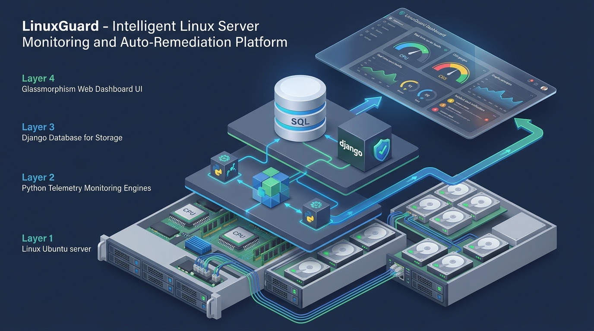

# LinuxGuard — Linux Server Monitoring & Automated Remediation

[](https://www.python.org/)
[](https://www.djangoproject.com/)
[](https://ubuntu.com/)
[](LICENSE)
[](tests/)
[-success.svg)](templates/)

---

## 📖 Project Overview

**LinuxGuard** is an enterprise-grade, real-time Linux server monitoring, incident correlation, and controlled auto-remediation platform built strictly with **Python**, **Django**, **Bash**, **SQL**, and **HTML5/CSS3** — featuring **zero client-side JavaScript**.

Designed for DevOps engineers, Site Reliability Engineers (SREs), and system administrators, LinuxGuard continuously ingests real host metrics (CPU, RAM, Disk, Network, systemd daemons, SSH authentication logs, system journals), detects threshold anomalies, correlates root causes using rule-based diagnostic engines, and executes safe, automated self-healing actions with post-execution verification and full auditability.

### The Problem
- **Alert Fatigue & Delayed MTTR**: Traditional monitoring tools bombard operators with raw metric spikes without correlating the underlying root cause (e.g., alerting on high CPU without pinpointing the offending process PID).
- **Fragile Client-Side Dashboards**: Heavy client-side JavaScript frameworks introduce large dependency trees, browser overhead, and potential security vectors in locked-down operational environments.
- **Risky Remediation**: Unrestricted automation scripts running arbitrary shell commands can cause cascading failures, downtime, or security breaches.
- **Lack of Auditability**: Automated corrective actions frequently lack forensic trails tracking what executed, who authorized it, and whether the system recovered.

### The LinuxGuard Solution
- **100% Server-Side Rendered (SSR)**: Lightning-fast, robust, glassmorphic UI built entirely with semantic HTML5 and pure CSS3.
- **Root Cause Correlation**: Diagnostic engine pairs symptom detection with confidence ratings, evidence synthesis, and actionable recommendations.
- **Safe, Closed-Loop Auto-Remediation**: Executes allowlisted commands strictly via `subprocess.run(shell=False)` with post-execution state verification (`systemctl is-active`).
- **Defense-in-Depth Security**: Strict token allowlisting, RBAC enforcement (`ADMIN`, `OPERATOR`, `VIEWER`), and immutable forensic audit logging.

---

## 🏗️ 3D System Architecture



*Figure 1: 3D Isometric System Architecture of the LinuxGuard Platform (Target Server Hardware → Python Telemetry Engines → LinuxGuard Core Analysis → Relational SQL Persistence & Django Web Application → Users).*

---

## ✨ Key Features

- **Real-Time Telemetry & System Gauges**: Ingests CPU utilization, per-core metrics, RAM & Swap saturation, disk partition usage, load averages (1m, 5m, 15m), and network socket states via `psutil` and `/proc`.
- **Live Process Inspection**: Real-time process enumeration with CPU/memory sorting, user filtering, and PID inspection.
- **Systemd Service Health**: Probes critical Linux daemons (`ssh`, `nginx`, `docker`, `mysql`, `postgresql`) with automatic unit existence verification.
- **Storage & Disk Diagnostic Reports**: Multi-partition capacity inspection, inode exhaustion tracking, and `/var/log` space breakdown.
- **SSH Security & Brute-Force Detection**: Real-time parsing of `/var/log/auth.log` to detect repeated authentication failures and trigger security incidents.
- **Intelligent Deduplication**: Prevents alert storms by updating existing open incidents rather than creating duplicate notifications.
- **Automated Self-Healing**: Safe, automatic recovery restarts for allowlisted daemons with immediate post-restart validation.
- **Human-in-the-Loop Approval Queue**: Operator-triggered diagnostics and Admin-approved workflows for sensitive operations.
- **Role-Based Access Control (RBAC)**: Enforces role permissions across `ADMIN`, `OPERATOR`, and `VIEWER` tiers.
- **Immutable Forensic Audit Logging**: Permanently records all user logins, telemetry polls, threshold adjustments, and remediation actions.

---

## 🔄 How It Works

LinuxGuard operates on a closed-loop, deterministic telemetry and self-healing lifecycle:

```mermaid
flowchart LR
    A[🐧 Target Linux Host] -->|1. Real Telemetry| B[🐍 Monitoring Engines]
    B -->|2. Ingest Metrics| C[🧠 Anomaly Detector & RCA]
    C -->|3. Diagnose & Correlate| D[⚙️ Policy & Security Gate]
    D -->|4. Allowlisted Action| E[🛡️ Safe Remediation]
    E -->|5. Verify State| A
    E -->|6. Record Audit| F[(🗄️ SQL Database)]
    F -->|7. SSR No JS| G[🖥️ Web Dashboard]

    classDef host fill:#dcfce7,stroke:#15803d,stroke-width:2px,color:#14532d;
    classDef monitor fill:#fef3c7,stroke:#d97706,stroke-width:2px,color:#78350f;
    classDef engine fill:#e0f2fe,stroke:#0284c7,stroke-width:2px,color:#0c4a6e;
    classDef sec fill:#fee2e2,stroke:#dc2626,stroke-width:2px,color:#7f1d1d;
    classDef db fill:#f3e8ff,stroke:#9333ea,stroke-width:2px,color:#581c87;
    classDef ui fill:#e0e7ff,stroke:#4f46e5,stroke-width:2px,color:#312e81;

    class A host;
    class B monitor;
    class C engine;
    class D,E sec;
    class F db;
    class G ui;
```



### End-to-End Workflow Stages

1. **Telemetry Ingestion**: Background worker queries `psutil`, `/proc`, `systemctl`, `journalctl`, and `/var/log/auth.log` with sub-second timeouts.
2. **Threshold Evaluation & Deduplication**: Evaluates metrics against dynamic settings (e.g., CPU > 85%, RAM > 90%, dead daemons, SSH brute force). Deduplication gate checks open incidents to prevent alert storms.
3. **Root Cause Analysis (RCA)**: `RootCauseEngine` correlates metric breaches with process tables and daemon logs to generate a **Probable Cause**, a **Confidence Score (70%–95%)**, and a **Remediation Recommendation**.
4. **Policy & Security Check**: `RemediationEngine` determines if the action qualifies for auto-remediation (safe allowlisted daemon) or requires operator/admin approval. `CommandSecurity` inspects command tokens against strict allowlists.
5. **Safe Execution & Verification**: Executes allowlisted command using `subprocess.run(command_list, shell=False, timeout=30)` and verifies state (`systemctl is-active`).
6. **Persistence & SSR Presentation**: Results are saved to SQL (`Incident`, `RemediationAction`, `AuditLog`) and rendered to the dashboard using pure HTML5/CSS3.

---

## 💻 Technology Stack

| Layer | Technology | Purpose |
| :--- | :--- | :--- |
| **Backend Framework** | Python 3.10+, Django 5.0+ | Server-side web framework, ORM, authentication, and management CLI |
| **System Telemetry** | `psutil` | CPU, memory, disk, network counters, and process enumeration |
| **Operating System** | Linux / Ubuntu, Bash | Kernel interfaces, systemd management, log parsing (`journalctl`, `auth.log`) |
| **Database** | SQLite (Dev) / MySQL (Prod) | Relational persistence for time-series metrics, incidents, and audit trails |
| **Testing** | `pytest`, `pytest-django` | Test suite with mocked Linux execution fixtures (40 tests passing) |
| **Frontend UI** | Semantic HTML5 & CSS3 | Zero-JavaScript Server-Side Rendered (SSR) glassmorphism interface |
| **Version Control** | Git | Distributed version control and CI workflows |

> **Zero-JavaScript Guarantee**: No client-side JavaScript, TypeScript, Node.js, React, or Vue is used. All UI interactions use standard HTML forms, CSRF tokens, GET/POST requests, HTTP redirects, and Django template rendering.

---

## 🧩 Main Components

```
┌──────────────────────────────────────────────────────────────────────────────────────────────────┐
│                                       LINUXGUARD SUBSYSTEMS                                      │
├──────────────────────────┬─────────────────────────────────────┬─────────────────────────────────┤
│ 🐍 Telemetry Engines     │ 🧠 Diagnostic & Remediation Core    │ 🌐 Web Application & Storage   │
├──────────────────────────┼─────────────────────────────────────┼─────────────────────────────────┤
│ • SystemMonitor (psutil) │ • AnomalyDetector (Threshold rules) │ • Django SSR Views & Templates  │
│ • ProcessMonitor         │ • SeverityEngine (Dynamic severity) │ • RBAC Decorators & Auth        │
│ • ServiceMonitor         │ • RootCauseEngine (RCA correlation) │ • Django ORM Relational Models  │
│ • DiskMonitor            │ • RemediationEngine (Self-healing)  │ • Background Worker CLI Command │
│ • NetworkMonitor         │ • CommandSecurity (Allowlists)      │ • SQLite / MySQL SQL Storage    │
│ • LogAnalyzer & SSH      │                                     │                                 │
└──────────────────────────┴─────────────────────────────────────┴─────────────────────────────────┘
```

- **`SystemMonitor` & `ProcessMonitor`**: Collects hardware metrics and top CPU/RAM consuming processes.
- **`ServiceMonitor`**: Validates status of critical daemons via safe `systemctl` queries.
- **`SSHMonitor` & `LogAnalyzer`**: Analyzes system error logs and detects brute-force SSH authentication spikes.
- **`AnomalyDetector`**: Evaluates active metrics against dynamic threshold rules with built-in deduplication.
- **`RootCauseEngine`**: Correlates multi-variate symptoms into actionable root causes with confidence scores.
- **`RemediationEngine`**: Manages the auto-remediation decision matrix, executes safe restarts, and performs post-execution validation.
- **`CommandSecurity`**: Enforces strict allowlist validation, forbids shell metacharacters, and blocks dangerous commands.
- **`monitor_server` CLI**: Long-running background daemon for continuous polling and self-healing.

---

## 🛡️ Security

LinuxGuard implements a defense-in-depth security architecture tailored for production environments:

1. **Zero Client-Side JavaScript**: Eliminates DOM-based XSS, client injection vulnerabilities, and vulnerable frontend NPM dependencies.
2. **Strict Command Allowlisting**: Only explicitly allowlisted command tokens (`systemctl restart <svc>`, `df -h`, `free -m`, `uptime`, `journalctl`) can be executed.
3. **Safe Subprocess Invocation**: All system commands run via `subprocess.run(command_list, shell=False, timeout=30)` to eliminate shell injection.
4. **Forbidden Command Blacklist**: Explicitly blocks destructive operations (`rm`, `rm -rf`, `shutdown`, `reboot`, `kill -9`, `chmod -R`, `mkfs`, `dd`).
5. **Service Parameter Validation**: Only known, safe alphanumeric service names (`ssh`, `nginx`, `docker`, `mysql`, `postgresql`) are accepted.
6. **Role-Based Access Control (RBAC)**:
   - **`ADMIN`**: Full access to all dashboards, server inventory, dynamic threshold settings, and high-risk remediation approvals.
   - **`OPERATOR`**: Access to monitoring telemetry, incident investigation, and manual safe remediation triggers.
   - **`VIEWER`**: Read-only observation across all server dashboards and metric views.
7. **Immutable Audit Trails**: Every user login, metric ingestion cycle, settings change, and remediation execution is permanently logged with timestamp, user ID, IP address, and status.

---

## 🚀 Installation & Getting Started

### Prerequisites
- **Python**: 3.10, 3.11, or 3.12
- **Operating System**: Ubuntu 20.04 / 22.04 / 24.04 LTS (or compatible Linux / development host)
- **Git**

### Step-by-Step Setup

```bash
# 1. Clone the repository
git clone https://github.com/Vishal-Bhavar96/linuxguard-server-monitoring-auto-remediation.git
cd linuxguard-server-monitoring-auto-remediation

# 2. Create and activate a Python virtual environment
python3 -m venv venv
source venv/bin/activate    # On Windows: venv\Scripts\activate

# 3. Install dependencies
pip install --upgrade pip
pip install -r requirements.txt

# 4. Copy environment configuration
cp .env.example .env

# 5. Apply database migrations
python manage.py makemigrations monitoring
python manage.py migrate

# 6. Seed demo accounts & nodes
python manage.py seed_demo_data
```

### Pre-Configured Demo Accounts

| Username | Password | Role | Permissions |
| :--- | :--- | :--- | :--- |
| **`admin`** | `AdminPass123!` | **`ADMIN`** | Full access, settings modification, approval queue, server management |
| **`operator`** | `OperatorPass123!` | **`OPERATOR`** | Telemetry inspection, incident investigation, safe manual remediation |
| **`viewer`** | `ViewerPass123!` | **`VIEWER`** | Read-only observation across all dashboards |

### Automated Ubuntu Setup Script

For automated dependency and environment provisioning on Ubuntu:

```bash
chmod +x scripts/*.sh
./scripts/setup_ubuntu.sh
```

### Running the Web Console

```bash
python manage.py runserver 0.0.0.0:8000
```
Open your browser at: **`http://localhost:8000/`** (or `http://127.0.0.1:8000/`)

### Running the Background Monitoring Worker

```bash
# Continuous background monitoring (30s polling interval)
python manage.py monitor_server --interval 30

# Single execution cycle (ideal for cron jobs or CI)
python manage.py monitor_server --once

# Monitor a specific server ID with custom interval
python manage.py monitor_server --server-id 1 --interval 15
```

### Running the Test Suite

```bash
pytest -v
```
*(All 40 tests pass with mocked Linux execution fixtures)*

---

## 📁 Project Structure

```
linuxguard-server-monitoring-auto-remediation/
├── .env.example                     # Environment configuration template
├── .gitignore                       # Git ignore rules
├── manage.py                        # Django management CLI entrypoint
├── pytest.ini                       # Pytest configuration
├── requirements.txt                 # Python dependencies
├── README.md                        # Project documentation
│
├── docs/                            # Architectural Visualizations & Documentation
│   └── architecture_3d.jpg          # 3D Isometric Architecture Diagram
│
├── linuxguard/                      # Django Project Configuration
│   ├── __init__.py
│   ├── asgi.py
│   ├── settings.py                  # Settings, DB config, RBAC setup, thresholds
│   ├── urls.py                      # Global URL dispatcher
│   └── wsgi.py
│
├── monitoring/                      # Core LinuxGuard Application
│   ├── admin.py                     # Django admin integration
│   ├── apps.py                      # App configuration
│   ├── context_processors.py        # Global navigation badges context processor
│   ├── decorators.py                # RBAC decorators (@admin_required, @operator_required)
│   ├── forms.py                     # Standard HTML forms (Server, Filters, Settings)
│   ├── models.py                    # Relational DB models (Server, Incident, AuditLog, etc.)
│   ├── urls.py                      # Application URL routes
│   ├── views.py                     # Zero-JS SSR view handlers
│   │
│   ├── engines/                     # Modular Monitoring & Remediation Engines
│   │   ├── __init__.py
│   │   ├── anomaly_detector.py      # Threshold evaluation & incident deduplication
│   │   ├── command_security.py      # Strict command allowlisting & safety validation
│   │   ├── disk_monitor.py          # Filesystem capacity & /var/log analysis
│   │   ├── log_analyzer.py          # Linux journalctl & log analysis
│   │   ├── network_monitor.py       # Socket connections, network counters, ping
│   │   ├── process_monitor.py       # psutil process enumeration & sorting
│   │   ├── remediation_engine.py    # Self-healing workflow & post-execution verification
│   │   ├── root_cause_engine.py     # Rule-based diagnostic correlation engine
│   │   ├── service_monitor.py       # Safe systemctl service health checker
│   │   ├── severity_engine.py       # Dynamic incident severity calculator
│   │   ├── ssh_monitor.py           # SSH brute-force & auth failure detector
│   │   └── system_monitor.py        # psutil hardware snapshot collector
│   │
│   └── management/
│       └── commands/
│           ├── monitor_server.py    # Periodic monitoring background worker CLI
│           └── seed_demo_data.py    # Initial RBAC users and seed node generator
│
├── scripts/                         # Linux Bash Automation Scripts
│   ├── collect_logs.sh              # System log archiving utility
│   ├── disk_report.sh               # Disk and directory space report
│   ├── health_check.sh              # Terminal-based host health diagnostic
│   └── setup_ubuntu.sh              # Ubuntu deployment and provisioning script
│
├── static/
│   └── css/
│       └── style.css                # Enterprise dark glassmorphism design system
│
├── templates/                       # Server-Side Rendered Django Templates (Zero JS)
│   ├── base.html                    # Base layout with sidebar navigation
│   ├── audit/index.html             # Audit trail search and logs
│   ├── auth/login.html              # Authentication login screen
│   ├── auth/profile.html            # User profile and role permissions
│   ├── dashboard/index.html         # Main command center dashboard
│   ├── incidents/list.html          # Incident management table
│   ├── incidents/detail.html        # Root cause analysis & remediation action view
│   ├── metrics/index.html           # Hardware telemetry & partition tables
│   ├── processes/index.html         # Live process table with sorting/filtering
│   ├── remediation/list.html        # Remediation actions & approval queue
│   ├── security/index.html          # Security events & attacking IP analytics
│   ├── servers/list.html            # Monitored server inventory
│   ├── servers/detail.html          # Server health view & aggregate stats
│   ├── servers/form.html            # Add / Edit server form
│   ├── servers/delete_confirm.html  # Server deletion confirmation
│   ├── services/index.html          # Systemd daemon health & restart controls
│   └── settings/index.html          # Dynamic threshold configuration
│
└── tests/                           # Automated Pytest Test Suite (40 Tests)
    ├── conftest.py                  # Pytest fixtures and mock setups
    ├── test_anomaly_detector.py     # Threshold and deduplication tests
    ├── test_audit_logging.py        # Audit trail and view SSR tests
    ├── test_auth_rbac.py            # RBAC roles and permission tests
    ├── test_command_security.py     # Command allowlisting and safety tests
    ├── test_disk_monitor.py         # Disk and network telemetry tests
    ├── test_log_analyzer.py         # Log parser and brute force tests
    ├── test_process_monitor.py      # Process enumeration tests
    ├── test_remediation_verification.py # Remediation execution & verification tests
    ├── test_service_monitor.py      # Service checker and mock tests
    ├── test_severity_engine.py      # Severity and root cause diagnosis tests
    └── test_system_monitor.py       # psutil hardware extraction tests
```

---

## 🔮 Future Scope

- **Multi-Node SSH Agent Ingestion**: Distributed telemetry collection across remote nodes over secure SSH tunnels.
- **Webhook & Alert Integrations**: Outbound alerting via Slack, Discord, Microsoft Teams, and PagerDuty webhooks.
- **Automated Memory Profiling**: Deep process heap profiling triggers when sustained RAM leaks are detected.
- **Custom Remediation Playbooks**: User-defined YAML runbooks with multi-stage verification gates and rollbacks.

---

## 📄 License

This project is licensed under the **MIT License** — see the [LICENSE](LICENSE) file for details.
